# Tutorial 12 - 17 arasında bulunan önemli olabilecek notlar

## [Chapter 12](T12_SignedUnsigned.vhd): HOW TO USE SIGNED AND UNSIGNED IN VHDL

**std_logic_vector** gibi VHDL'de **signed** ve **unsigned** veri tipleri *bit vektörüdür.* Tek farkları *std_logic_vector*'lerin veri depolamada iyi olmalarına karşın aritmatik işlemlerde pek iyi değillerdir.

Eğer 2 tane **std_logic_vector** tipinde değişkeni toplayacak olursanız *Modelsim* size şu hatayı verecektir: *No feasible entries for infix operator "+".*

### Signed ve Unsigned Syntax

`signal <name> : signed(<N-bits> downto 0) := <initial_value>;`

`signal <name> : unsigned(<N-bits> downto 0) := <initial_value>;`

Tıpkı vektörlerde olduğu gibi `downto` veya `to` olarak tanımlayabiliriz.

Initial değer opsiyonel olduğu için, eğer bir değer tanımlamazsanız **default olarak** `'U'` değeri atanacaktır tüm bit değerlerine.

Signed ve Unsigned değişkenlerinin belirli bir değer aralığı vardır. Eğer simülatör bu değer aralıklarını aşarsa *run-time error* hatası verecektir. Ve ek olarak atayabileceğimiz 2 farklı değer vardır **integer değişkeninden farklı olarak.** Bu değerlerimiz `'U'` ve `'X'` değerlerimizdir. Bu meta değerler bizlere debugging yapmakta ve hata bulma konusunda yardımcı olacaktır.

### Örnek kod çıktısı 1

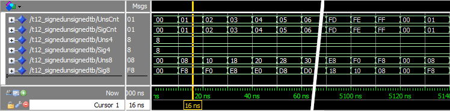

`UnsCnt` ve `SgnCnt` değişkenleri arttırma olarak benzer davranışlar sergiliyor. İki değişken de **FF** değerine geldiğinde (Ki bu değer bu değişkenler için memoryde tutulabilecek en büyük değer) bir sonraki arttırma işleminde **0**'a dönüyorlar.

`Uns4` ve `Sig4` de ise değişik bir durum oluşuyor. `Uns4` kendi değerini alırken `Sig4` değeri ilk bit **sign bit**'i olduğu için negatif değer olarak geçiyor. Bu durumdan dolayı atadığımız `"1000"` değeri `Uns4` için istediğimiz gibi çalışırken `Sig4` için yanlış çalışmaktadır.

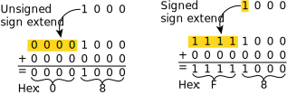

## [Chapter 13](T13_ConcurrentProcs.vhd): HOW TO CREATE A CONCURRENT STATEMENT IN VHDL

Concurrent statement'ler *Signal* atamalarının **architure bölümünde** **process bölümünün dışarısında** yapılması ile oluşturulur.

Gerçek anlamında eğer bir *Concurrent Statement* oluşturmak, basit ve kesin bir şekilde **sensitivity process** oluşturmak ile eş değerdir.

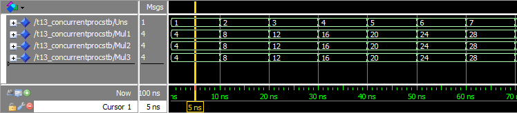

`Mul1`, `Mul2` ve `Mul3` aslında aynı şeyleri farklı process'ler içerisinde göstermek için oluşturulmuş değişkenlerdir.

`Uns` değişkenimiz **6 bit** içeriyor ve `Mul1` ve diğer değişkenler ise **8 bit** içeriyor. Bu bit farkını tamamlamak için `& "00"` şeklinde ekleme yaptık.

Processler içerisindeki işlem ise shift operasyonunun ta kendisidir.


## [Chapter 14](T14_CaseWhen.vhd): HOW TO USE A CASE-WHEN STATEMENT IN VHDL

`Case-When` statement'leri signal, variable veya expression'lar da belirli durumlar gerçekleştiğinde gerçekleşecek olan işlemleri belirtmemize yarıyor. *(İf-Else'nin daha güzel gözüken bir versiyonu.)*

### Case-When statement Syntax

```VHDL
case <expression> is
    when <choice> =>
        code for this branch
    when <choice> =>
        code for this branch
    ...
end case;
```

`<expression>` genelde *sinyal* veya *variable* olmaktadır. Birden fazla `when` seçeneği olabilir fakat her defasında en fazla **bir tane** seçilebilir durumdadır.

`<choice>`'in alabileceği değerler:

* **"11"**, belirli bir değeri belirtmen için kullanılabilir.
* **5 to 10**, belirli aralığı belirtmen için kullanılır.
* **1|3|5**, belirli değerleri aynı anda belirtmek için kullanılır.
* **others**, Else komutu gibi çalışmaktadır.

### Örnek kod çıktısı 2

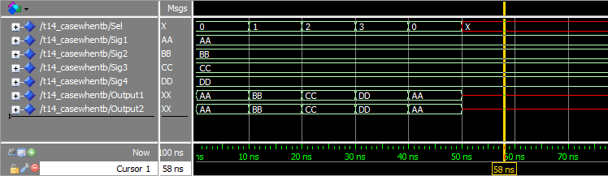

```TXT
# ** Warning: NUMERIC_STD."=": metavalue detected, returning FALSE
#    Time: 50 ns  Iteration: 1  Instance: /T14_CaseWhen
# ** Warning: NUMERIC_STD."=": metavalue detected, returning FALSE
#    Time: 50 ns  Iteration: 1  Instance: /T14_CaseWhen
# ** Warning: NUMERIC_STD."=": metavalue detected, returning FALSE
#    Time: 50 ns  Iteration: 1  Instance: /T14_CaseWhen
# ** Warning: NUMERIC_STD."=": metavalue detected, returning FALSE
#    Time: 50 ns  Iteration: 1  Instance: /T14_CaseWhen
```

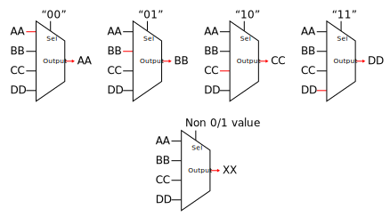

## Chapter 15 [ [1](T15_Mux.vhd) [2](T15_PortMap.vhd) ]: HOW TO USE PORT MAP INSTANTIATION IN VHDL

Aslında oluşturduğumuz *modül*ü bir *unit kod VHDL* olarak düşünebiliriz. **Mödüller** dış dünya ile **entity** üzerinden haberleşirler. Bu *entity* içerisinde `input` ve `output` parametreleri bulunmaktadır.

Önceki projelerin aksine bu projede tüm kodları bir dosyaya yazmıyoruz. Modülümüzün olduğu dosyayı ana dosyamıza *import* ediyoruz ve compile ederken **ilk modülleri compile** etmemiz gerekmektedir.

Inputları veya outputları olmayan modüller *gerçek projelerde* kullanılmaz.

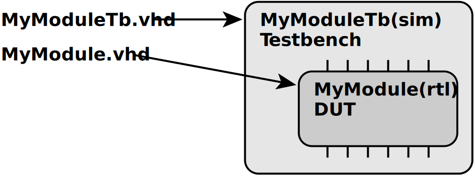

**DUT**: *Device Unter Test*

### Modül Port Syntax

```VHDL
entity <entity_name> is
port(
    <entity_signal_name> : in|out|inout <signal_type>;
    ...
);
end entity
```

### Modülü instance Syntax

```VHDL
<label> : entity <library_name>.<entity_name>(<architecture_name>) port map(
    <entity_signal_name> => <local_signal_name>,
    ...
);
```

* `<label>` dediğimiz instance ettiğimiz değişken olarak düşünebiliriz, her hangi bir ad olabilir.
* `<library_name>` ise o anki çalıştığımız proje dosyasıdır. **Bizim çalıştığımız dosya 'work' dosyasıdır.**
* `<entity_name>` ve `<architecture_name>` modülümüzde belirlediğimiz adlar ile eşleşmelidir.

### Örnek Kod Çıktısı 3

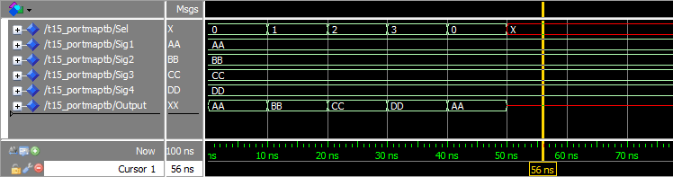

* Tıpkı önceki dosya çıktısı gibi fakat buradaki fark bunu farklı bir dosya içerisinde hesaplayıp geri döndürmemizdir.
* Eğer bir modülde input veya output sinyalleri yoksa o dosyaya **testbench** denir ve sadece simülatör kullanabilir.
* Input veya output içeren modülleri direkt olarak simülatörde kullanamayız.

## Chapter 16 [ [1](T16_GenericMap.vhd) [2](T16_GenericMux.vhd) ] : HOW TO USE CONSTANTS AND GENERIC MAP IN VHDL

Bu projemizde açıkcası **sabit** olan değişkenleri **generik** (yani değişebilen) değişkenler kullanarak oluşturduğumuz modülün kullanablirliğini arttırıyoruz.

Ana dosya içerisinde oluşturduğumuz **constant** değişken ise her zaman aynı sayıyı yazmamak için kullanırız ve daha sonrada değerini değişip de programın işleyişini bozabilecek durumları engellemek için kullanırız. Bu değişkeni de `generic map` ile *modül*ümüze iletmemiz gerekmektedir.

### Constant Syntax

`constant <constant_name> : <type> := <value>;`

Artık modül içerisinde bulunan **entity** bölümümüz şöyle olacaktır.

### Entity Syntax 2

```VHDL
entity <entity_name> is
generic(
    <entity_constant_name> : <type>;
    ...
);
port(
    <entity_signal_name> : in|out|inout <type>;
    ...
);
end entity;
```

Simüle edilecek dosyamız içerisinde de tanımlamalarımız şöyle olacaktır.

### Proje Dosyası Syntax

```VHDL
<label> : entity <library_name>.<entity_name>(<architecture_name>)
generic map(
    <entity_constant_name> => <value_or_constant>,
    ...
)
port map(
    <entity_signal_name> => <local_signal_name>,
    ...
);
```

### Örnek Kod Çıktısı 4

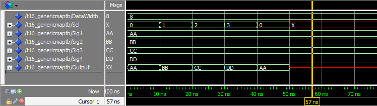

## Chapter 17 [ [1](T17_ClockedProcess.vhd) [2](T17_FlipFlop.vhd) ]: HOW TO CREATE A CLOCKED PROCESS IN VHDL

Bir çok VHDL sistemi **clocked logic** kullanır. *Synchronous logic,  sequential logic* olarak da bilinir. Basit bir clock kullanma sistemi oluşturmak istiyorsak **flip flop** modülü oluşturabiliriz.

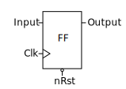

Eğer Flip Flop nedir diye merak ediyorsanız, [link](https://en.wikipedia.org/wiki/Flip-flop_(electronics)) üzerinden öğrenebilirsiniz.

Basit bir **clocked process** oluşturmak istiyorsak şu kod uygun olabilir.

```VHDL
process(Clk) is
begin
    if rising_edge(Clk) then
        if nRst = '0' then
            <reset all output signals here>
        else
            <main logic here>
        end if;
    end if;
end process;
```

### Örnek Kod çıktısı 6

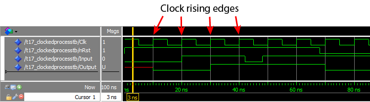

Oluşturduğumuz sistemin basit bir animasyonu şöyle olabilir.

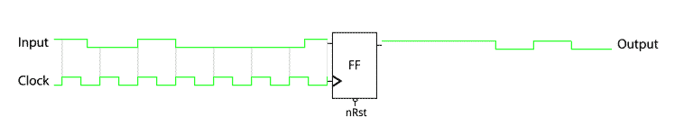

Her 45 ns de bir aktif olan çıktı durumu ters duruma getirilir.
