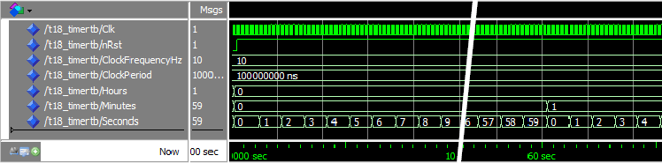
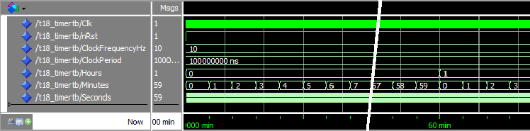
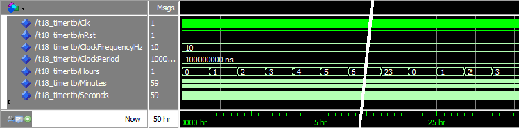
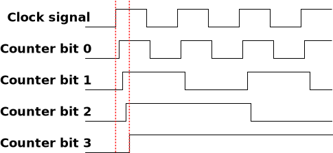
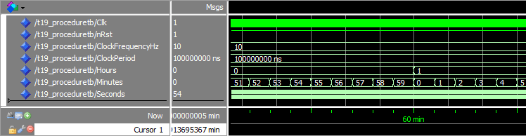
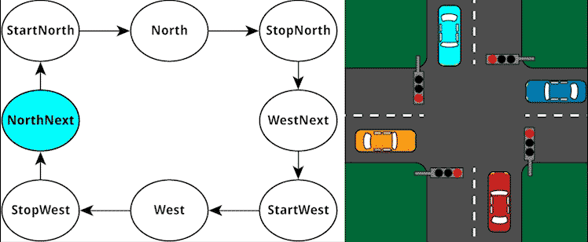
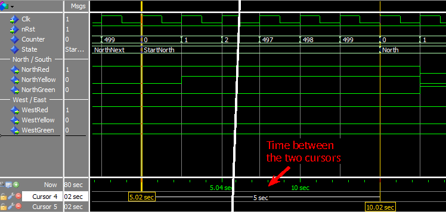

# Tutorial 18 - 23 arasında bulunan önemli olabilecek notlar

## Chapter 18: HOW TO CREATE A TIMER IN VHDL

Şu ana kadar *time-delay* işlemini gerçekleştirmek için `wait for` fonksiyonunu kullanık. Fakat modüller içerisinde `wait for` fonksiyonunu kullanamayız, bu fonksiyon sadece *simülasyon* aşamasında kullanılır.

Mödüller için ise *clock cycles* kullanırız. Her dijital sistem **en az 1 clock signal**'e sahip olması gerekir. Eğer biz *clock frequency*'i 100MHz olarak biliyorsak, 1 saniyede *1 milyon* kere **clock cycle** çalışır.

Eğer istersek salise, saniye, dakika, saat veya gün clock-counter'i yapabiliriz fakat her şeyin bir alan işgal ettiğini kabul edersek saniye az alan işgal ederken gün'ün veya ay'ın işgal edeceği alan saniye ile kıyasla bayağı bir şekilde fazla olacaktır.

### Saniye Çıktısı



### Dakika Çıktısı



### Saat Çıktısı



* Saniye olarak çalıştırmak için `run 10 seconds`
* Dakika olarak çalıştırmak için `run 10 min`
* Saat olarak çalıştırmak için `run 10 hr`

### Counter Bit'ler şöyle gözükecektir



## Chapter 19: HOW TO USE A PROCEDURE IN VHDL

**Procedure** olarak tanıtılan yapı aslında geri bir değer döndürmeyen fonksiyonlardır fakat içerdikleri *inout* veya *out* parametrelerin değerlerini değiştirebilir

### Procedure Syntax

```VHDL
procedure <procedure_name> (signal|variable|constant <name1> : in|out|inout <type>;
                            signal|variable|constant <name2> : in|out|inout <type>;
                            ... ) is
    <declarations_for_use_within_the_procedure>
begin
    <code_performed_by_the_procedure_here>
end procedure;
```

Procedure başlangıçlarını tıpkı önceden yaptığımız gibi *is* ve *begin* kullanarak işlemlerimizi gerçekleştireceğimiz yere ulaşırız.
Parametre olarak *constants, variables, types, subtypes, ve aliases* içerebilirler fakat **signal** değerleri **içeremezler**.

Fonksiyonlardan farklı olarak, procedure'ler *wait* komutu içermek **zorunda değillerdir** fakat istenildiği zaman wait komutunu kullanabilir.

### Örnek Kod Çıktısı 1



Aslında çıktımız bir öncekiler ile aynı fakat bu aşamada kodumuzu daha modüler yapıp daha az satır kod ile aynı işlemleri yapıyoruz.

## Chapter 20: HOW TO CREATE A FINITE-STATE MACHINE IN VHDL

Finite-State Machine (FSM), çıktı parametresi bir önceki duruma bağlı olur. Yani her çıktı bir önceki çıktıya bağımlıdır, bir önceki çıktı, o anki çıktıya direkt olarak etki eder *finite-state machine*'de.

Eğer zamana bağlı bir algoritma yazacaksak *VHDL* üzerinden, bunu yapmanın en iyi yolu *finite-state machine* ile yapmaktır.

Yapacağımız **finite-state machine** mekanizması bir trafik lambaları uygulaması olacak.



Bu stateleri daha iyi kullanmak için VHDL içerisinde **enumerated type** oluşturuyoruz. Böylece sadece sşgned veya unsigned değerler içermek yerine daha farklı değerleri bir arada tutabiliriz.

### VHDL'de örnek bir Enumerated Type Syntaxı

```VHDL
type <type_name> is (<state_name1>, <state_name2>, ...);
signal <signal_name> : <type_name>;
```

### Basit, bir durumlu Finite-State Machine Kodu

```VHDL
process(Clk) is
begin
    if rising_edge(Clk) then
        if nRst = '0' then
            State <= <reset_state>;
        else
            case State is
                when <state_name> =>
                    <set_outputs_for_this_state_here>
                    if <state_change_condition_is_true> then
                        State <= <next_state_name>;
                    end if;
                ...
            end case;
        end if;
    end if;
end process;
```

Finite-state machine, tüm durumları kontrol edebilmeli.

### Örnek Kod Çıktısı 2


run 5 min ile bu çıktıyı elde edebiliriz.

## Chapter 21: HOW TO USE A FUNCTION IN VHDL

Fonksiyonları belirli bir algoritma içeren alt-programlar olarak varsayabiliriz. Bir fonksiyon 0 veya daha fazla parametre alabilir ve geriye **kesinlikle bir değer döndürür**. Ek olarak fonksiyonlar *wait* komutları içermezler, bu nedenden dolayı 0 işlem zamanında çalışırlar.

VHDL dilinde 2 çeşit fonksiyon vardır, bunlar *pure* ve *impure* adlarına sahiptir.

**Pure** fonksiyonlar gelen parametreleri *değiştirmez* ve dışarıdan *başka bir signal okumazlar*. Şundan emin olabiliriz ki eğer bir *pure fonksiyon* çağırıyorsak, gönderdiğimiz ve göndermediğimiz değişkenlerde her hangi bir değişim gerçekleşmeyecektir.

### Pure-impure fonksiyon tanımlama Syntax

```VHDL
[pure|impure] function <function_name> (<parameter1_name> : <parameter1_type> := <default_value>;
                                        <parameter2_name> : <parameter2_type> := <default_value>;
                                        ... ) return <return_type> is
    <constant_or_variable_declaration>
begin
    <code_performed_by_the_function>
    return <value>
end function;
```

Bir fonksiyon tanımlarken *pure veya impure* keywordlerini kullanmazsak, program default olarak **pure** atayacaktır fonksiyonun başına (*pure ve impure* keywordleri opsiyoneldir). Ek olarak tanımlamalarda bulunan *default_value*'de opsiyoneldir, atama yapmazsak her hangi bir sıkıntı olmayacaktır.

Fonksiyonlar son bölümünde `return` komutunu içermek zorundadır.

Tıpkı diğer tanımlamalar gibi, fonksiyonların da kendilerine özel `is` ve `begin` bölümleri vardır ve bu bölümlerden sonra işlemlerimizi gerçekleştiririz. Ek olarak fonksiyon içerisinde oluşturduğumuz ara değişkenler fonksiyon sonlanınca yok olurlar, dışarıdan bir etki ile bu değişkenlere erişilemez.

### Örnek Kod Çıktısı 3 (run 5 min)


### Örnek Kod Çıktısı 4



Burada `if Counter = ClockFrequencyHz * 5 -1 then` komutunu daha kompakt bir hale getirmek için fonksiyon tanımladık ve şöyle bir hal aldı.

`if Counter = CounterVal(Seconds => 5) then`

## Chapter 22: HOW TO USE AN IMPURE FUNCTION IN VHDL

*Impure fonksiyonlar* kendi parametre listesinde olan veya olmayan her hangi bir signal'i okuyup değiştirebilir. Impure fonksiyonların bu etkisine **side effect** denir.

Yani bu demektir ki, aynı parametreleri hiç değiştirmeden tekrar gönderseniz bile **aynı sonucu alamayabilirsiniz**. Çünkü *impure fonksiyon*ların dışarıdan hangi sinyalleri nasıl okuduğunu tam olarak bilemeyiz. Bu okunan signal'lere *shadow parameters* denir.

Normal fonksiyon tanımlar gibi tanımlıyoruz impure fonksiyonları, fakat *process* içerisinde tanımlamak ve kullanmak daha uygun olur. 

Peki neden ihtiyacımız var *impure fonksiyonlara*? Çünkü; eğer çok sayıda signal'e sahipsek ve bunların her birini pure fonksiyonun parametre listesine yazmamız gerekcekti ve bu durumda çok uzun bir paramatre listesine sahip olacaktık.

*impure fonksiyonu* tanımlarken `function` yazmak yerine `impure function` yazmamız yeterli olacaktır.

Bu bölümde değiştireceğimiz kısım `CounterVal` fonksiyonun yapısı olacaktır. `Counter` değişkenini etkileyecektir.

### Örnek Kod Çıktısı 5


Mantıksal olarak çıktılarımızda hiç bir şey değişmedi fakat kod yapısı olarak değişikliğe gidildi.

Yeni *impute function* oluşturduk `CounterExpired` adında. Bu fonksiyon `Counter <= 0;` satırında Counter signal'ini resetlemeye yarıyor.

## Chapter 23: HOW TO USE A PROCEDURE IN A PROCESS IN VHDL
